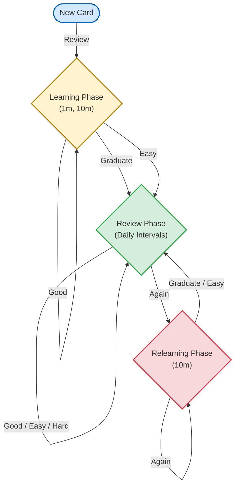

# Kalima

Kalima is an intelligent vocabulary learning application built to accelerate language acquisition. By combining **Large Language Models (LLMs)** with a **Spaced Repetition System (SRS)**, it eliminates the manual work of creating flashcards and guarantees long-term retention.

---

## 🚀 Core Technologies & Integrations

| Technology | Purpose | Implementation Details |
| :--- | :--- | :--- |
| **Gemini & Groq** | Automated Context | Automatically generates detailed meanings, synonyms, antonyms, and memorable custom mnemonics for new words. |
| **ElevenLabs** | Premium TTS | Generates highly natural, human-like voice pronunciations (fallback to Apple AVSpeechSynthesizer if offline). |
| **DictionaryAPI** | Data Verification | Provides structured fallback linguistic data. |
| **Firebase REST** | Backend Sync | Secure cloud syncing across devices using Identity Toolkit & Firestore without bloated SDKs. |

> **Note:** API Keys are protected via `.gitignore`. You must provide your own `GoogleService-Info.plist` and configure AI tokens in the app settings.

---

## 🧠 The Spaced Repetition Engine

Kalima does not use standard spaced repetition. It utilizes a heavily customized, SM-2 derived algorithm. The engine schedules reviews exactly when you are most likely to forget a word, dynamically adapting to your memory performance.

### Rating Impact Table

When reviewing a flashcard, the grade you assign strictly controls the algorithm's mathematical response:

| Rating | Scenario | Interval Change | Ease Factor (`e`) |
| :--- | :--- | :--- | :--- |
| 🔴 **Again** | Forgot the word | Drops to Relearning queue (mins) | Penalized (`e - 0.20`) |
| 🟠 **Hard** | Difficult to recall | `Interval * 1.2` | Penalized (`e - 0.15`) |
| 🟢 **Good** | Normal recall | `Interval * e` | **Unchanged** |
| 🔵 **Easy** | Instant recall | `Interval * e * 1.3` (Bonus) | Boosted (`e + 0.15`) |

*A global **Fuzz Factor** (±5%) is applied to all intervals to prevent clustered review spikes in the future.*

### Algorithm Workflow

The algorithm state machine smoothly transitions cards from short-term memory (minutes) to long-term memory (days):

## 🛠 Project Setup

1. Clone the repository.
2. Download your `GoogleService-Info.plist` from the Firebase Console and place it in the `Kalima` directory (ensure it is added to your Xcode target).
3. Build and run on an iOS 17.0+ Simulator or Device.
4. **Configure AI Keys**: You can either input your API keys directly into the app's Settings menu, or for development, create a `Secrets.plist` file in your Xcode project with the keys `GEMINI_API_KEY`, `GROQ_API_KEY`, `ELEVENLABS_API_KEY`, and `MW_API_KEY`. This file is git-ignored to prevent accidental commits.
